# Phase 2 — Domain設計書

## 概要

Domain層はUnity・Lighthouseに依存しない純粋なC#で構成される。  
リポジトリインターフェースの非同期はプロジェクト統一方針に従い UniTask を使用する。

---

## 冒険者の死亡と人数管理

- 冒険者がダンジョン内でHPが0になった場合は**永続削除**される（復活手段なし）
- ゲーム中の同時存在冒険者数は最大 **20人**（`GameConfigSpec.maxAdventurerCount` に準拠）
- 総数が上限を下回った場合、一定期間ごとに新規冒険者が自動到着して補充される（Phase 5 AI実装）
- 削除は `IAdventurerRepository.RemoveAsync()` で行い、宿屋のベッドも同時に解放する

---

## フォルダ構成

```
Assets/DungeonInn/Runtime/Scripts/Domain/
├── Entity/
│   ├── CharacterBase.cs
│   ├── Adventurer.cs
│   ├── InnKeeper.cs
│   ├── InnStaff.cs
│   ├── Monster.cs
│   ├── Bed.cs
│   ├── Inn.cs
│   └── DungeonFloor.cs
├── ValueObject/
│   ├── CharacterId.cs
│   ├── AdventurerId.cs
│   ├── MonsterId.cs
│   ├── Gold.cs
│   ├── Satisfaction.cs
│   ├── GridPosition.cs
│   ├── LandSize.cs
│   ├── DungeonFloorNumber.cs
│   └── GameTime.cs
├── Enum/
│   ├── PersonalityType.cs
│   ├── AdventurerState.cs
│   ├── MonsterBehaviorPatternType.cs
│   ├── GridCellType.cs
│   ├── TimeScaleType.cs
│   ├── GameTimeEventType.cs
│   └── StaffRoleType.cs
├── Repository/
│   ├── IInnRepository.cs
│   ├── IAdventurerRepository.cs
│   └── IDungeonRepository.cs
└── Service/
    ├── SatisfactionDomainService.cs
    └── GameTimeDomainService.cs
```

---

## 値オブジェクト

| クラス名 | 基底型 | 説明 |
|---|---|---|
| `CharacterId` | `string` | キャラクターの識別子 |
| `AdventurerId` | `string` | 冒険者の識別子（CharacterIdのサブセット） |
| `MonsterId` | `string` | モンスターの識別子 |
| `Gold` | `int` | 所持金・費用（0以上） |
| `Satisfaction` | `int` | 満足度（0〜100） |
| `GridPosition` | `struct` | グリッド座標（X, Y, Z: int）UnityEngine非依存 |
| `LandSize` | `struct` | 土地サイズ（Width, Depth: int、グリッド単位） |
| `DungeonFloorNumber` | `int` | ダンジョン階層番号（1〜5） |
| `GameTime` | `struct` | ゲーム内時間（Day: int, Hour: float 0〜24） |

### 値オブジェクト詳細

```csharp
// GridPosition — UnityEngine.Vector3Int の代替（Domain非依存）
readonly struct GridPosition
{
    public int X { get; }
    public int Y { get; }
    public int Z { get; }
    public float DistanceTo(GridPosition other);   // XZ平面距離
}

// Gold — 負値禁止
readonly struct Gold
{
    public int Value { get; }
    public Gold Add(Gold other);
    public Gold Subtract(Gold other);              // 不足時は ArgumentException
}

// Satisfaction — 0〜100 範囲保証
readonly struct Satisfaction
{
    public int Value { get; }                      // 0〜100
    public bool IsHighSatisfaction => Value >= 70;
    public bool IsLowSatisfaction  => Value <  40;
}

// GameTime
readonly struct GameTime
{
    public int Day { get; }
    public float Hour { get; }                     // 0.0〜24.0
    public bool IsMorning => Hour is >= 6f and < 10f;
    public bool IsEvening => Hour is >= 18f and < 22f;
    public bool IsNight   => Hour >= 22f || Hour < 6f;
}
```

---

## 列挙型

```csharp
enum PersonalityType { Cautious, Aggressive, Social, Solitary, Balanced }

enum AdventurerState
{
    Staying,             // 宿屋滞在中（休憩）
    MovingToDungeon,     // ダンジョンへ移動中
    ChallengingDungeon,  // ダンジョン挑戦中
    ReturningToInn,      // 宿屋へ帰還中
}

enum MonsterBehaviorPatternType { Wander, Patrol, Aggressive, Territorial }

enum GridCellType { Empty, Wall, Floor, StairUp, StairDown }

enum TimeScaleType { Pause, Half, Normal, Double, Quadruple }

enum GameTimeEventType { MorningStarted, EveningStarted, NightStarted, NewDay }

enum StaffRoleType { Receptionist, Cleaner }
```

---

## エンティティ設計

### CharacterBase（抽象基底）

```csharp
abstract class CharacterBase
{
    public CharacterId Id { get; }
    public string DisplayName { get; }
    public int Hp { get; protected set; }
    public int MaxHp { get; }
    public int AttackPower { get; }
    public int Defense { get; }
    public float MoveSpeed { get; }
    public float AttackSpeed { get; }
    public PersonalityType Personality { get; }

    public bool IsAlive => Hp > 0;
    public void TakeDamage(int damage);
    public void Heal(int amount);
}
```

---

### Adventurer : CharacterBase

```csharp
class Adventurer : CharacterBase
{
    public AdventurerId AdventurerId { get; }
    public Gold Gold { get; private set; }
    public Satisfaction Satisfaction { get; private set; }
    public AdventurerState State { get; private set; }
    public float SightRange { get; }             // 視界範囲（m）
    public float SightAngle { get; }             // 視野角（度）
    public float PrivacySensitivity { get; }     // プライバシー感度 0.0〜1.0
    public int PrivacyViolationCount { get; private set; }  // 休憩中の視線侵害累計

    // 将来拡張用プレースホルダー
    // public IReadOnlyList<Equipment> Equipment { get; }

    public void TransitionState(AdventurerState nextState);
    public void AddGold(Gold amount);
    public void SpendGold(Gold amount);          // 不足時は InvalidOperationException
    public void UpdateSatisfaction(Satisfaction satisfaction);
    public void IncrementPrivacyViolation();
    public void ResetPrivacyViolation();         // ダンジョン出発時にリセット
}
```

---

### InnKeeper : CharacterBase

```csharp
class InnKeeper : CharacterBase
{
    // Phase 5以降で能力拡張予定
}
```

---

### InnStaff : CharacterBase（将来拡張）

```csharp
class InnStaff : CharacterBase
{
    public StaffRoleType Role { get; }
    public Gold DailyWage { get; }
}
```

---

### Monster : CharacterBase

```csharp
class Monster : CharacterBase
{
    public MonsterId MonsterId { get; }
    public DungeonFloorNumber FloorNumber { get; }
    public GridPosition CurrentPosition { get; private set; }
    public GridPosition NextWaypoint { get; private set; }
    public MonsterBehaviorPatternType BehaviorPattern { get; }
    public float WanderRadius { get; }

    public void MoveTo(GridPosition position);
    public void SetNextWaypoint(GridPosition waypoint);
}
```

---

### Bed

```csharp
class Bed
{
    public string BedSpecId { get; }                          // マスタ参照キー
    public GridPosition Position { get; }
    public AdventurerId? OccupiedBy { get; private set; }
    public int AdjacentEmptyBlockCount { get; private set; } // 配置時に計算・設定
    public float ComfortBonus { get; }                        // マスタから取得して保持

    public bool IsOccupied => OccupiedBy.HasValue;
    public void AssignAdventurer(AdventurerId adventurerId);
    public void Release();
    public void SetAdjacentEmptyBlockCount(int count);
}
```

---

### Inn

```csharp
class Inn
{
    public LandSize LandSize { get; private set; }                       // 初期 10×10m
    public Gold Gold { get; private set; }
    public IReadOnlyList<Bed> Beds { get; }
    public IReadOnlyList<AdventurerId> StayingAdventurerIds { get; }

    public void AddGold(Gold amount);
    public void SpendGold(Gold amount);
    public void ExpandLand(LandSize additionalSize);
    public void PlaceBed(Bed bed);
    public void RemoveBed(Bed bed);
    public void AddStayingAdventurer(AdventurerId id);
    public void RemoveStayingAdventurer(AdventurerId id);
}
```

---

### DungeonFloor

```csharp
class DungeonFloor
{
    public DungeonFloorNumber FloorNumber { get; }
    public int Width { get; }
    public int Depth { get; }
    public GridCellType[,] Grid { get; }                    // 迷路データ
    public IReadOnlyList<GridPosition> UpStairs { get; }    // 上り階段（最低1つ）
    public IReadOnlyList<GridPosition> DownStairs { get; }  // 下り階段（B5Fは空）
    public IReadOnlyList<Monster> Monsters { get; }

    public bool IsWalkable(GridPosition position);
    public GridCellType GetCell(GridPosition position);
    public void AddMonster(Monster monster);
    public void RemoveMonster(MonsterId monsterId);
}
```

---

## ドメインサービス設計

### SatisfactionDomainService

冒険者の満足度を3スコアの重み付き合計で算出する。

```csharp
class SatisfactionDomainService
{
    // 総合満足度を算出（0〜100）
    Satisfaction CalculateSatisfaction(
        Adventurer adventurer,
        Bed assignedBed,
        IReadOnlyList<Bed> allBeds);

    // スコア1: ベッド間距離スコア 0.0〜1.0
    //   最寄り他者ベッドとの距離が遠いほど高スコア。閾値(例5m)以上は1.0
    float CalculateBedDistanceScore(Bed targetBed, IReadOnlyList<Bed> allBeds);

    // スコア2: 周囲空きブロックスコア 0.0〜1.0
    //   周囲8方向の空きブロック数 / 8
    float CalculateAdjacentEmptyBlockScore(Bed bed);

    // スコア3: プライバシー侵害スコア 0.0〜1.0（高いほど良い）
    //   侵害回数が多いほど低スコア。PrivacySensitivity で個人差
    float CalculatePrivacyViolationScore(Adventurer adventurer);
}
```

**満足度算出ロジック**

```
rawScore =
    CalculateBedDistanceScore    * 0.4   // 重み 40%
  + CalculateAdjacentEmptyBlock  * 0.3   // 重み 30%
  + CalculatePrivacyViolation    * 0.3   // 重み 30%

comfortBonus = bed.ComfortBonus          // 0.0〜1.0 → 最大 +10点

Satisfaction.Value = Clamp(rawScore * 100 + comfortBonus * 10, 0, 100)
```

---

### GameTimeDomainService

ゲーム内時間の進行とイベント発火を管理する。

```csharp
class GameTimeDomainService
{
    public GameTime CurrentTime { get; private set; }
    public TimeScaleType CurrentTimeScale { get; private set; }
    public bool IsPaused => CurrentTimeScale == TimeScaleType.Pause;

    // リアル20分(1200秒) = ゲーム内24時間 → 1実秒 = 0.02ゲーム内時間
    const float GameHoursPerRealSecond = 24f / 1200f;

    static readonly IReadOnlyDictionary<TimeScaleType, float> TimeScaleMultipliers =
    {
        Pause     = 0.0f,
        Half      = 0.5f,
        Normal    = 1.0f,
        Double    = 2.0f,
        Quadruple = 4.0f,
    };

    // deltaTime（リアル秒）を渡して時間を進める。発生したイベントを返す
    IReadOnlyList<GameTimeEventType> Tick(float deltaTimeSec);

    void SetTimeScale(TimeScaleType timeScale);
}
```

**イベント発火ルール**

| イベント | 発火条件 |
|---|---|
| `MorningStarted` | Hour が 6.0 を跨いだとき |
| `EveningStarted` | Hour が 18.0 を跨いだとき |
| `NightStarted` | Hour が 22.0 を跨いだとき |
| `NewDay` | Hour が 24.0（→ 0.0 にリセット）を跨いだとき |

---

## リポジトリインターフェース

プロジェクト統一方針に従い UniTask を使用する。

### IInnRepository

```csharp
interface IInnRepository
{
    UniTask<Inn> GetAsync(CancellationToken ct);
    UniTask SaveAsync(Inn inn, CancellationToken ct);
}
```

### IAdventurerRepository

```csharp
interface IAdventurerRepository
{
    UniTask<IReadOnlyList<Adventurer>> GetAllAsync(CancellationToken ct);
    UniTask<Adventurer?> FindByIdAsync(AdventurerId id, CancellationToken ct);
    UniTask<int> CountAsync(CancellationToken ct);
    UniTask SaveAsync(Adventurer adventurer, CancellationToken ct);
    UniTask SaveAllAsync(IReadOnlyList<Adventurer> adventurers, CancellationToken ct);
    // ダンジョン死亡時など永続削除が確定した場合に呼ぶ。復活手段はない
    UniTask RemoveAsync(AdventurerId id, CancellationToken ct);
}
```

### IDungeonRepository

```csharp
interface IDungeonRepository
{
    UniTask<DungeonFloor> GetFloorAsync(DungeonFloorNumber floorNumber, CancellationToken ct);
    UniTask<IReadOnlyList<DungeonFloor>> GetAllFloorsAsync(CancellationToken ct);
    UniTask SaveFloorAsync(DungeonFloor floor, CancellationToken ct);
}
```

---

## クラス図

```mermaid
classDiagram
    class CharacterBase {
        <<abstract>>
        +CharacterId Id
        +string DisplayName
        +int Hp
        +int MaxHp
        +int AttackPower
        +int Defense
        +float MoveSpeed
        +float AttackSpeed
        +PersonalityType Personality
        +TakeDamage(int)
        +Heal(int)
    }

    class Adventurer {
        +Gold Gold
        +Satisfaction Satisfaction
        +AdventurerState State
        +float SightRange
        +float SightAngle
        +float PrivacySensitivity
        +int PrivacyViolationCount
        +TransitionState(AdventurerState)
        +AddGold(Gold)
        +SpendGold(Gold)
        +UpdateSatisfaction(Satisfaction)
        +IncrementPrivacyViolation()
        +ResetPrivacyViolation()
    }

    class InnKeeper {
    }

    class InnStaff {
        +StaffRoleType Role
        +Gold DailyWage
    }

    class Monster {
        +MonsterId MonsterId
        +DungeonFloorNumber FloorNumber
        +GridPosition CurrentPosition
        +GridPosition NextWaypoint
        +MonsterBehaviorPatternType BehaviorPattern
        +float WanderRadius
        +MoveTo(GridPosition)
        +SetNextWaypoint(GridPosition)
    }

    class Bed {
        +string BedSpecId
        +GridPosition Position
        +AdventurerId? OccupiedBy
        +int AdjacentEmptyBlockCount
        +float ComfortBonus
        +AssignAdventurer(AdventurerId)
        +Release()
        +SetAdjacentEmptyBlockCount(int)
    }

    class Inn {
        +LandSize LandSize
        +Gold Gold
        +IReadOnlyList~Bed~ Beds
        +IReadOnlyList~AdventurerId~ StayingAdventurerIds
        +AddGold(Gold)
        +SpendGold(Gold)
        +ExpandLand(LandSize)
        +PlaceBed(Bed)
        +RemoveBed(Bed)
    }

    class DungeonFloor {
        +DungeonFloorNumber FloorNumber
        +int Width
        +int Depth
        +GridCellType[,] Grid
        +IReadOnlyList~GridPosition~ UpStairs
        +IReadOnlyList~GridPosition~ DownStairs
        +IReadOnlyList~Monster~ Monsters
        +IsWalkable(GridPosition) bool
        +AddMonster(Monster)
        +RemoveMonster(MonsterId)
    }

    class SatisfactionDomainService {
        +CalculateSatisfaction(Adventurer, Bed, IReadOnlyList~Bed~) Satisfaction
        +CalculateBedDistanceScore(Bed, IReadOnlyList~Bed~) float
        +CalculateAdjacentEmptyBlockScore(Bed) float
        +CalculatePrivacyViolationScore(Adventurer) float
    }

    class GameTimeDomainService {
        +GameTime CurrentTime
        +TimeScaleType CurrentTimeScale
        +bool IsPaused
        +Tick(float) IReadOnlyList~GameTimeEventType~
        +SetTimeScale(TimeScaleType)
    }

    class IInnRepository {
        <<interface>>
        +GetAsync(CancellationToken) UniTask~Inn~
        +SaveAsync(Inn, CancellationToken) UniTask
    }

    class IAdventurerRepository {
        <<interface>>
        +GetAllAsync(CancellationToken) UniTask~IReadOnlyList~Adventurer~~
        +FindByIdAsync(AdventurerId, CancellationToken) UniTask~Adventurer~
        +CountAsync(CancellationToken) UniTask~int~
        +SaveAsync(Adventurer, CancellationToken) UniTask
        +SaveAllAsync(IReadOnlyList~Adventurer~, CancellationToken) UniTask
        +RemoveAsync(AdventurerId, CancellationToken) UniTask
    }

    class IDungeonRepository {
        <<interface>>
        +GetFloorAsync(DungeonFloorNumber, CancellationToken) UniTask~DungeonFloor~
        +GetAllFloorsAsync(CancellationToken) UniTask~IReadOnlyList~DungeonFloor~~
        +SaveFloorAsync(DungeonFloor, CancellationToken) UniTask
    }

    CharacterBase <|-- Adventurer
    CharacterBase <|-- InnKeeper
    CharacterBase <|-- InnStaff
    CharacterBase <|-- Monster

    Inn "1" o-- "*" Bed
    DungeonFloor "1" o-- "*" Monster

    SatisfactionDomainService ..> Adventurer
    SatisfactionDomainService ..> Bed

    IInnRepository ..> Inn
    IAdventurerRepository ..> Adventurer
    IDungeonRepository ..> DungeonFloor
```



---

*作成日: 2026-04-29*  
*フェーズ: Phase 2 — Domain設計*
