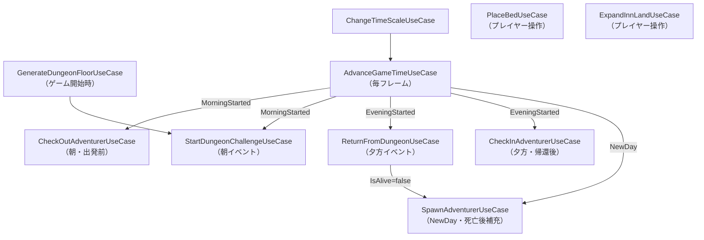

# Phase 3 — UseCase設計書

## 概要

UseCase層はDomain層にのみ依存する。Unity・Lighthouse・Presentationには依存しない。  
非同期は UniTask で統一する。各ユースケースは VContainer で DI 登録される。

---

## フォルダ構成

```
Assets/DungeonInn/Runtime/Scripts/UseCase/
├── CheckIn/
│   ├── CheckInAdventurerUseCase.cs
│   └── CheckInResult.cs
├── CheckOut/
│   ├── CheckOutAdventurerUseCase.cs
│   └── CheckOutResult.cs
├── Bed/
│   ├── PlaceBedUseCase.cs
│   ├── PlaceBedResult.cs
│   └── PlaceBedPreviewResult.cs
├── Land/
│   └── ExpandInnLandUseCase.cs
├── Dungeon/
│   ├── StartDungeonChallengeUseCase.cs
│   ├── ReturnFromDungeonUseCase.cs
│   ├── ReturnFromDungeonResult.cs
│   └── GenerateDungeonFloorUseCase.cs
├── Adventurer/
│   └── SpawnAdventurerUseCase.cs
└── Time/
    ├── AdvanceGameTimeUseCase.cs
    └── ChangeTimeScaleUseCase.cs
```

---

## ユースケース一覧

| ユースケース | 概要 |
|---|---|
| `CheckInAdventurerUseCase` | 冒険者を宿屋に受け入れ、ベッドをアサインする |
| `CheckOutAdventurerUseCase` | 冒険者が出発し、満足度に応じて料金を徴収する |
| `PlaceBedUseCase` | ベッドを指定座標に配置する（配置前のプレビューも提供） |
| `ExpandInnLandUseCase` | 土地を5m×5m単位で購入・拡張する |
| `StartDungeonChallengeUseCase` | 冒険者がダンジョンへ出発する |
| `ReturnFromDungeonUseCase` | 冒険者がダンジョンから帰還する（HP・所持金を反映） |
| `AdvanceGameTimeUseCase` | ゲーム内時間を進め、朝夜イベントをトリガーする |
| `ChangeTimeScaleUseCase` | ポーズ・早送り・スローを切り替える |
| `GenerateDungeonFloorUseCase` | ゲーム開始時にダンジョン全階層をランダム生成する |
| `SpawnAdventurerUseCase` | 新規冒険者を生成し、最大人数（20人）に達するまで補充する |

---

## 各ユースケース詳細

---

### CheckInAdventurerUseCase

冒険者を宿屋に受け入れ、空きベッドをアサインする。

#### 依存

| 依存 | 用途 |
|---|---|
| `IAdventurerRepository` | 冒険者の取得・保存 |
| `IInnRepository` | 宿屋の取得・保存 |

#### 入力

```csharp
class CheckInAdventurerUseCase
{
    // bedId: null の場合は空きベッドを自動選択（先頭の空きベッド）
    UniTask<CheckInResult> ExecuteAsync(
        AdventurerId adventurerId,
        GridPosition? preferredBedPosition,
        CancellationToken ct);
}
```

#### 処理フロー

1. `IAdventurerRepository` から冒険者を取得
2. 冒険者が `Staying` 状態でないことを確認
3. `IInnRepository` から宿屋を取得
4. 指定座標のベッドを取得（未指定なら空きベッドを自動選択）
5. ベッドが空きであることを確認
6. `Bed.AssignAdventurer(adventurerId)` でアサイン
7. `Inn.AddStayingAdventurer(adventurerId)` で宿泊者リストに追加
8. `Adventurer.TransitionState(AdventurerState.Staying)` で状態遷移
9. 宿屋・冒険者を保存

#### 出力

```csharp
class CheckInResult
{
    public AdventurerId AdventurerId { get; }
    public GridPosition AssignedBedPosition { get; }
}
```

#### 例外ケース

| 例外 | 発生条件 |
|---|---|
| `AdventurerNotFoundException` | 指定IDの冒険者が存在しない |
| `AdventurerAlreadyStayingException` | 冒険者がすでに `Staying` 状態 |
| `NoAvailableBedException` | 空きベッドが1つも存在しない |
| `BedAlreadyOccupiedException` | 指定座標のベッドがすでに使用中 |

---

### CheckOutAdventurerUseCase

冒険者の宿泊を締め、満足度に応じた料金を徴収する。

#### 依存

| 依存 | 用途 |
|---|---|
| `IAdventurerRepository` | 冒険者の取得・保存 |
| `IInnRepository` | 宿屋の取得・保存 |
| `SatisfactionDomainService` | 満足度の算出 |

#### 入力

```csharp
class CheckOutAdventurerUseCase
{
    UniTask<CheckOutResult> ExecuteAsync(AdventurerId adventurerId, CancellationToken ct);
}
```

#### 処理フロー

1. 冒険者と宿屋を取得
2. 冒険者が `Staying` 状態であることを確認
3. アサイン済みベッドを取得
4. `SatisfactionDomainService.CalculateSatisfaction()` で満足度を算出
5. `Adventurer.UpdateSatisfaction()` で満足度を反映
6. 支払い金額を決定
   - 低満足度（< 40）: 基本料金のみ
   - 高満足度（>= 70）: 基本料金 + チップ（基本料金の30%）
   - 中間: 基本料金のみ
7. `Adventurer.SpendGold()` で冒険者から徴収
8. `Inn.AddGold()` で宿屋に加算
9. `Bed.Release()` でベッド解放
10. `Inn.RemoveStayingAdventurer()` で宿泊者リストから削除
11. `Adventurer.TransitionState(AdventurerState.MovingToDungeon)` で状態遷移
12. 保存

#### 出力

```csharp
class CheckOutResult
{
    public AdventurerId AdventurerId { get; }
    public Satisfaction Satisfaction { get; }
    public Gold BasicRate { get; }
    public Gold Tip { get; }          // 低満足度時は Gold(0)
    public Gold TotalPayment { get; } // BasicRate + Tip
}
```

#### 例外ケース

| 例外 | 発生条件 |
|---|---|
| `AdventurerNotFoundException` | 指定IDの冒険者が存在しない |
| `AdventurerNotStayingException` | 冒険者が `Staying` 状態でない |
| `InsufficientGoldException` | 冒険者の所持金が基本料金未満（踏み倒し）※将来対応 |

---

### PlaceBedUseCase

ベッドを指定グリッド座標に配置する。配置前のプレビュー（満足度スコア試算）も提供する。

#### 依存

| 依存 | 用途 |
|---|---|
| `IInnRepository` | 宿屋の取得・保存 |
| `SatisfactionDomainService` | 満足度スコアのプレビュー計算 |

#### 入力

```csharp
class PlaceBedUseCase
{
    // プレビュー（保存しない）: 配置した場合の満足度スコアを返す
    UniTask<PlaceBedPreviewResult> PreviewAsync(
        string bedSpecId,
        GridPosition position,
        CancellationToken ct);

    // 実配置（保存する）
    UniTask<PlaceBedResult> ExecuteAsync(
        string bedSpecId,
        GridPosition position,
        CancellationToken ct);
}
```

#### 処理フロー（ExecuteAsync）

1. 宿屋を取得
2. 指定座標が宿屋の土地内であることを確認
3. 指定座標にすでにベッドがないことを確認
4. 周囲8方向の空きブロック数を計算し `Bed.SetAdjacentEmptyBlockCount()` でセット
5. `Inn.SpendGold()` でベッド購入コストを支払い
6. `Inn.PlaceBed()` でベッドを追加
7. 保存

#### 処理フロー（PreviewAsync）

上記 2〜4 のバリデーションと空きブロック数計算を行い、仮 Bed を構築して `SatisfactionDomainService` で満足度スコアを試算する。保存はしない。

#### 出力

```csharp
class PlaceBedPreviewResult
{
    public GridPosition Position { get; }
    public float BedDistanceScore { get; }       // 0.0〜1.0
    public float AdjacentEmptyBlockScore { get; } // 0.0〜1.0
    public float EstimatedSatisfaction { get; }  // 0〜100（プライバシースコアは0として試算）
    public bool CanPlace { get; }
}

class PlaceBedResult
{
    public GridPosition Position { get; }
    public string BedSpecId { get; }
}
```

#### 例外ケース

| 例外 | 発生条件 |
|---|---|
| `InvalidBedPositionException` | 座標が土地外または別のベッドと重複 |
| `InsufficientGoldException` | 宿屋の資金がベッド購入コスト未満 |

---

### ExpandInnLandUseCase

土地を5m×5m単位で購入・拡張する。

#### 依存

| 依存 | 用途 |
|---|---|
| `IInnRepository` | 宿屋の取得・保存 |

#### 入力

```csharp
class ExpandInnLandUseCase
{
    UniTask ExecuteAsync(string expansionId, CancellationToken ct);
}
```

#### 処理フロー

1. 宿屋を取得
2. マスタから `LandExpansionSpec` を取得
3. 先行拡張IDが全て購入済みであることを確認
4. 同一 `expansionId` が未購入であることを確認
5. `Inn.SpendGold()` でコストを支払い
6. `Inn.ExpandLand()` で土地を拡張
7. 購入済み拡張IDとして記録
8. 保存

#### 出力

なし（void）

#### 例外ケース

| 例外 | 発生条件 |
|---|---|
| `InsufficientGoldException` | 宿屋の資金が購入コスト未満 |
| `PrerequisiteExpansionNotPurchasedException` | 先行拡張が未購入 |
| `ExpansionAlreadyPurchasedException` | すでに同じ拡張を購入済み |

---

### StartDungeonChallengeUseCase

冒険者をダンジョンへ送り出す。

#### 依存

| 依存 | 用途 |
|---|---|
| `IAdventurerRepository` | 冒険者の取得・保存 |
| `IDungeonRepository` | 対象階層の存在確認 |

#### 入力

```csharp
class StartDungeonChallengeUseCase
{
    UniTask ExecuteAsync(
        AdventurerId adventurerId,
        DungeonFloorNumber targetFloor,
        CancellationToken ct);
}
```

#### 処理フロー

1. 冒険者を取得
2. 冒険者が `Staying` 状態であることを確認
3. 対象ダンジョン階層が存在することを確認
4. `Adventurer.ResetPrivacyViolation()` でプライバシー侵害カウントをリセット
5. `Adventurer.TransitionState(AdventurerState.MovingToDungeon)` で状態遷移
6. 保存

#### 出力

なし（void）

#### 例外ケース

| 例外 | 発生条件 |
|---|---|
| `AdventurerNotFoundException` | 指定IDの冒険者が存在しない |
| `AdventurerNotAvailableException` | 冒険者が `Staying` 状態でない |
| `DungeonFloorNotFoundException` | 対象階層が生成されていない |

---

### ReturnFromDungeonUseCase

冒険者がダンジョンから帰還し、HP と所持金を更新する。

#### 依存

| 依存 | 用途 |
|---|---|
| `IAdventurerRepository` | 冒険者の取得・保存・永続削除 |
| `IInnRepository` | 死亡時のベッド解放のため宿屋を取得・保存 |

#### 入力

```csharp
class ReturnFromDungeonUseCase
{
    UniTask<ReturnFromDungeonResult> ExecuteAsync(
        AdventurerId adventurerId,
        int hpLost,
        Gold goldGained,
        CancellationToken ct);
}
```

#### 処理フロー

1. 冒険者を取得
2. 冒険者が `ChallengingDungeon` または `MovingToDungeon` 状態であることを確認
3. `Adventurer.TakeDamage(hpLost)` でHP減少（0未満にはならない）
4. HP が 0 になった場合（死亡）:
   a. 宿屋を取得し、当該冒険者が使用中のベッドがあれば `Bed.Release()` で解放
   b. `Inn.RemoveStayingAdventurer()` で宿泊者リストからも除去（念のため）
   c. 宿屋を保存
   d. `IAdventurerRepository.RemoveAsync()` で冒険者を永続削除（復活なし）
   e. `IsAlive = false` の結果を返して終了（以降の処理は行わない）
5. 生存の場合:
   a. `Adventurer.AddGold(goldGained)` で所持金加算
   b. `Adventurer.TransitionState(AdventurerState.ReturningToInn)` で状態遷移
   c. 保存

#### 出力

```csharp
class ReturnFromDungeonResult
{
    public AdventurerId AdventurerId { get; }
    public int CurrentHp { get; }
    public Gold CurrentGold { get; }
    public bool IsAlive { get; }   // false の場合、冒険者はリポジトリから永続削除済み
}
```

#### 例外ケース

| 例外 | 発生条件 |
|---|---|
| `AdventurerNotFoundException` | 指定IDの冒険者が存在しない |
| `AdventurerNotInDungeonException` | 冒険者がダンジョン関連状態でない |

---

### AdvanceGameTimeUseCase

ゲーム内時間を進め、発生したイベントを返す。毎フレームから呼び出される。

#### 依存

| 依存 | 用途 |
|---|---|
| `GameTimeDomainService` | 時間進行・イベント発火 |

#### 入力

```csharp
class AdvanceGameTimeUseCase
{
    // deltaTimeSec: Unity の Time.deltaTime（リアル秒）
    IReadOnlyList<GameTimeEventType> Execute(float deltaTimeSec);
}
```

> 毎フレーム呼ばれる処理のため、非同期にしない（UniTaskではなく同期）。

#### 処理フロー

1. `GameTimeDomainService.Tick(deltaTimeSec)` を呼び出す
2. 発生したイベントリストをそのまま返す
3. 呼び出し元（Presenter）がイベントに応じて各ユースケースを起動する

#### 出力

`IReadOnlyList<GameTimeEventType>` — 発生したゲーム内時間イベント

#### 例外ケース

なし

---

### ChangeTimeScaleUseCase

タイムスケールを切り替える。

#### 依存

| 依存 | 用途 |
|---|---|
| `GameTimeDomainService` | タイムスケール変更 |

#### 入力

```csharp
class ChangeTimeScaleUseCase
{
    void Execute(TimeScaleType timeScale);
}
```

#### 処理フロー

1. `GameTimeDomainService.SetTimeScale(timeScale)` を呼び出す

#### 出力

なし（void）

#### 例外ケース

なし

---

### GenerateDungeonFloorUseCase

ゲーム開始時に全5階層のダンジョンをランダム生成する。

#### 依存

| 依存 | 用途 |
|---|---|
| `IDungeonRepository` | 生成した階層の保存 |

#### 入力

```csharp
class GenerateDungeonFloorUseCase
{
    // seed: null の場合はランダムシード
    UniTask<IReadOnlyList<DungeonFloor>> ExecuteAsync(int? seed, CancellationToken ct);
}
```

#### 処理フロー

1. seed を確定（null なら乱数生成）
2. 各階層（FloorNumber 1〜5）に対して以下を実行:
   a. マスタから `DungeonFloorSpec` を取得（マップサイズ・モンスター設定等）
   b. 再帰的バックトラッキング法で迷路グリッド（`GridCellType[,]`）を生成
   c. 上り階段・下り階段をランダムな `Floor` セルに配置
      - 上り階段: B2F〜B5F のみ（B1F は地上へ出る出口として扱う）
      - 下り階段: B1F〜B4F のみ（B5F は下層なし）
      - 各最低1つ、上り下りが同一座標にならないよう配慮
   d. `DungeonFloor` エンティティを生成
   e. `IDungeonRepository.SaveFloorAsync()` で保存
3. 全5フロアのリストを返す

#### 出力

`IReadOnlyList<DungeonFloor>` — 生成した全階層エンティティ

#### 例外ケース

| 例外 | 発生条件 |
|---|---|
| `DungeonFloorSpecNotFoundException` | マスタに該当階層スペックが存在しない |
| `MazeGenerationFailedException` | 迷路生成が最大試行回数内に完了しなかった（通常起こらない） |

---

---

### SpawnAdventurerUseCase

新規冒険者を1人生成してリポジトリに追加する。最大人数（20人）に達している場合は何もしない。

#### 依存

| 依存 | 用途 |
|---|---|
| `IAdventurerRepository` | 現在人数確認・新規冒険者の保存 |

#### 入力

```csharp
class SpawnAdventurerUseCase
{
    // specId: null の場合はAdventurerSpecのプールからランダム選択
    UniTask<SpawnAdventurerResult> ExecuteAsync(string? adventurerSpecId, CancellationToken ct);
}
```

#### 処理フロー

1. `IAdventurerRepository.CountAsync()` で現在の冒険者数を確認
2. `count >= maxAdventurerCount`（20）であればスポーンせず `Spawned = false` を返す
3. `adventurerSpecId` が null の場合はマスタのプールからランダム選択
4. `AdventurerSpec` からパラメータを読み込み、`Adventurer` エンティティを生成
5. 初期状態は `AdventurerState.ReturningToInn`（村から宿屋へ向かう想定）
6. `IAdventurerRepository.SaveAsync()` で保存

#### 出力

```csharp
class SpawnAdventurerResult
{
    public bool Spawned { get; }                  // false = 上限到達でスキップ
    public AdventurerId? AdventurerId { get; }    // Spawned = false のときは null
}
```

#### 例外ケース

| 例外 | 発生条件 |
|---|---|
| `AdventurerSpecNotFoundException` | 指定IDのAdventurerSpecが存在しない |

---

## ユースケース間の呼び出し関係



---

## DI登録方針（VContainer）

各ユースケースは `GameLifetimeScope`（または相当するスコープ）に登録する。  
Lighthouseの `LifetimeScope` 構造はPhase 4でシーン構成を確定してから整理する。

```csharp
// 登録例（Phase 4以降に確定）
builder.Register<CheckInAdventurerUseCase>(Lifetime.Scoped);
builder.Register<CheckOutAdventurerUseCase>(Lifetime.Scoped);
builder.Register<PlaceBedUseCase>(Lifetime.Scoped);
builder.Register<ExpandInnLandUseCase>(Lifetime.Scoped);
builder.Register<StartDungeonChallengeUseCase>(Lifetime.Scoped);
builder.Register<ReturnFromDungeonUseCase>(Lifetime.Scoped);
builder.Register<AdvanceGameTimeUseCase>(Lifetime.Scoped);
builder.Register<ChangeTimeScaleUseCase>(Lifetime.Scoped);
builder.Register<GenerateDungeonFloorUseCase>(Lifetime.Scoped);
```

---

*作成日: 2026-04-29*  
*フェーズ: Phase 3 — UseCase設計*
